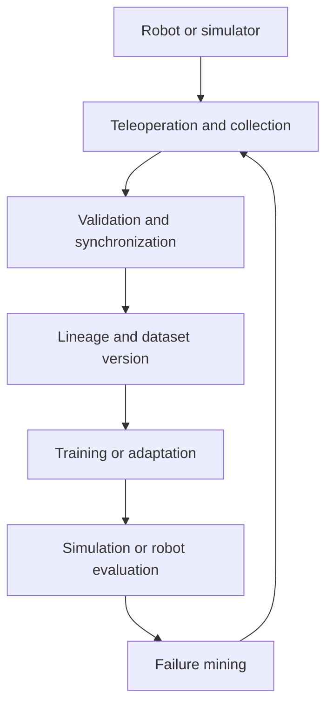

# Architecture

Embodied-DataOps is the operational layer connecting robot interactions, datasets, training, and evaluation.

## Planned system boundaries

- Episode schemas bind observations, actions, timestamps, calibration, and provenance.
- Validation rejects missing, corrupted, or misaligned trajectories.
- Dataset versions remain traceable to source episodes and transformations.
- Training and evaluation consume immutable dataset contracts.
- Failures create explicit data requirements rather than silent dataset edits.

## Current evidence boundary

This repository is an active build. Unless a module is explicitly marked implemented and verified, architecture sections describe the target system rather than completed deployment.
